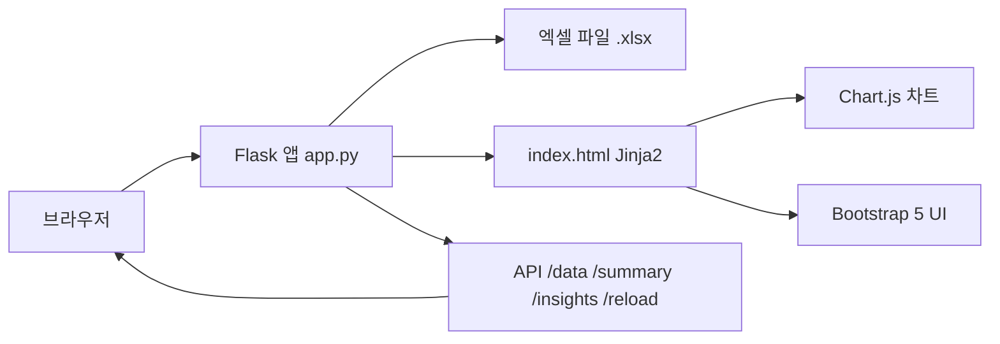

# Finance Dashboard — CLAUDE.md

## 프로젝트 문서
- API 스펙: @docs/api-spec.md
- 데이터 스키마: @docs/data-schema.md
- 세션 진행 기록: @docs/session-log.md
- 알려진 문제 코드: @docs/known-issues.md

## 아키텍처



## 기술 스택
- **Backend**: Python · Flask · openpyxl · waitress
- **Frontend**: Bootstrap 5 · Bootstrap Icons · Chart.js · Jinja2
- **데이터**: 로컬 엑셀 파일 (시트명: `취합`)

## 파일 구조
```
dashboard/
├── app.py                    # Flask 앱 + 전체 API
├── templates/
│   ├── base.html             # 공통 레이아웃
│   └── index.html            # 메인 대시보드 UI
├── static/style.css          # 커스텀 스타일
├── docs/                     # 상세 문서
├── requirements.txt
├── start_server.bat
└── .claude/
    ├── settings.json         # 훅 · 권한 설정 (공유)
    └── skills/deploy/        # /deploy 스킬
```

## Claude 자동화 설정 (`.claude/settings.json`)

### Stop 훅
Claude 종료 전 자동으로 아래 세 가지를 점검:
1. 요청된 기능·수정이 코드에 반영됐는가
2. 브라우저 또는 테스트로 동작이 확인됐는가
3. 필요한 경우 GitHub push가 완료됐는가

하나라도 미완료면 종료하지 않고 작업 계속.

### 스킬
- `/deploy`: 커밋 → push → `docs/session-log.md` 기록 갱신
- `/ppt-generator`: 주제 입력 → 슬라이드 설계 → .pptx 자동 생성

## 규칙
- `.env` 파일은 API 키·비밀번호 등 **보안 민감 정보**에만 사용. 로컬 경로 등 단순 설정은 코드에 직접 유지
- AI 지시사항(CLAUDE.md, settings.json, 스킬)은 모두 GitHub에 공유
- 세션 완료 시 `docs/session-log.md` 업데이트, 문제 발생 시 `docs/known-issues.md` 기록
- 커밋 메시지는 한국어로 작성

## Git
- Remote: `https://github.com/ghtjd1358/Finance-Dashboard.git`
- Branch: `main`
